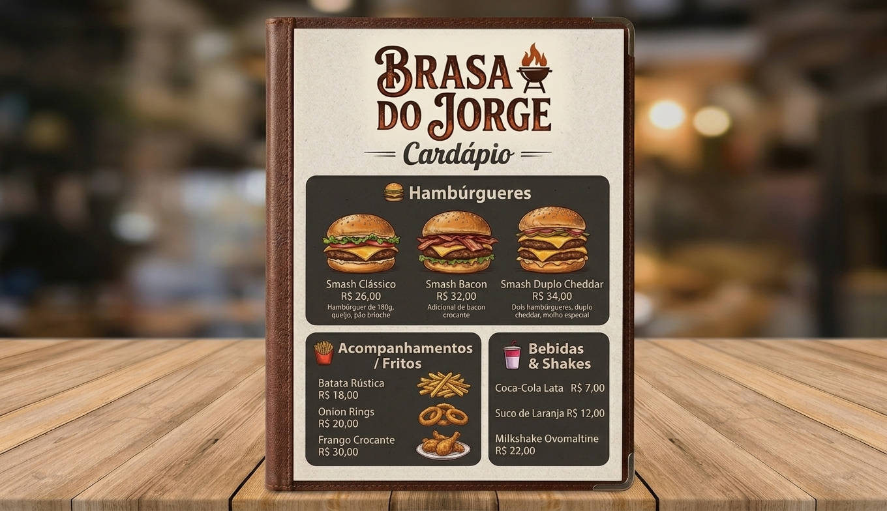
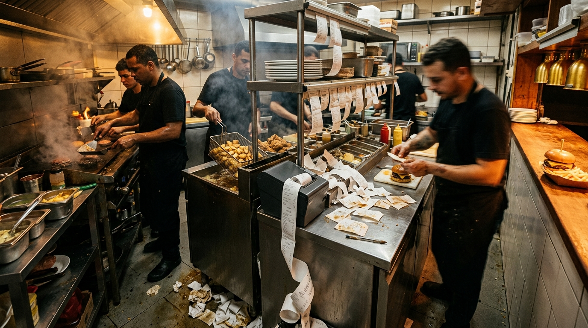
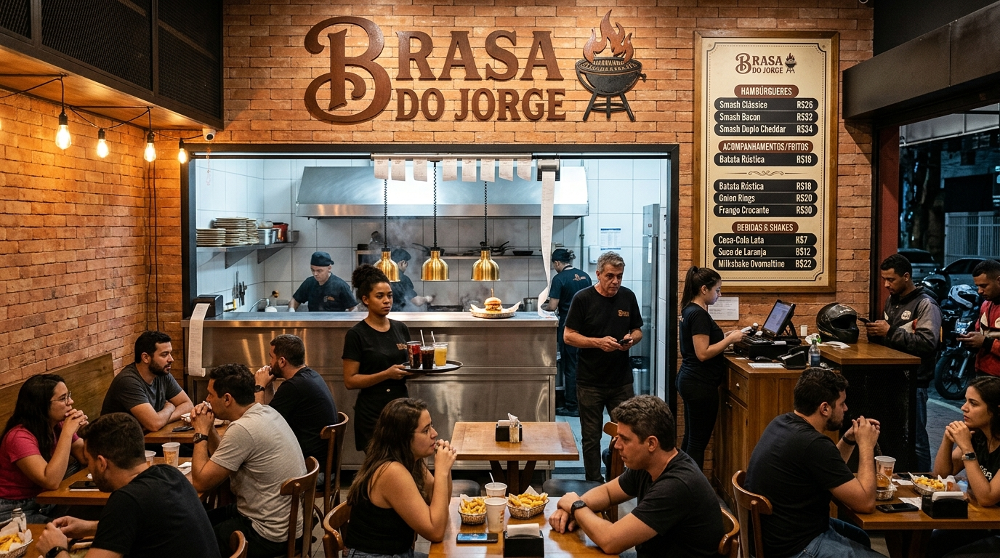

# Desafio Front-end · Pigz

Olá! Este é o desafio técnico de Front-end da Pigz. Ele é o **mesmo para todos os níveis** — júnior, pleno ou sênior. Você entrega até onde conseguir, e a **profundidade da sua entrega é o que mostra o seu nível** (não precisa dizer qual é). Lá no fim tem uma seção **[Níveis](#níveis-a-entrega-define-o-nível)** explicando como isso funciona.

Aqui a gente não te entrega uma tela pronta pra você copiar. A gente te apresenta um problema de um lojista e quer ver como você chega da dor até uma solução funcionando: entender o que importa, decidir o que fazer, projetar e construir.

Não existe um documento de requisitos fechado. Você é dono da solução. Boa parte do que a gente avalia é o que você decide construir, o que decide deixar de fora, e como defende essas escolhas.

## Sobre usar IA

Pode usar, e a gente recomenda. Claude, Copilot, o que você usa no dia a dia. Trabalhamos com IA aqui o tempo todo, então não faz sentido te avaliar num cenário que não é o real.

Não estamos medindo se você digitou o código na mão. Estamos olhando se você sabe conduzir a ferramenta, revisar o que sai dela, jogar fora o que não serve e sustentar cada decisão.

Por isso, no seu README, conte como usou IA: onde ela ajudou, onde ela errou e você corrigiu, e o que você fez questão de decidir por conta própria. Ser transparente conta a favor. Entregar código que você não sabe explicar conta contra.

## O cenário: Brasa do Jorge

A **Brasa do Jorge** é uma hamburgueria artesanal de bairro, ponto de rua, 4 anos de casa, fama de "melhor smash da região". Você foi até lá conhecer a operação. Segue o que você viu e ouviu.

### Os números (mês passado)
- ~**3.200 pedidos/mês** (~110 por dia), ticket médio **R$ 52**
- Faturamento ~**R$ 166 mil/mês**
- **60% do movimento** se concentra sexta e sábado, das **19h às 22h30**
- Canais de pedido: **Salão/balcão 35%** · **WhatsApp 25%** · **Apps (iFood + Pigz) 40%**
- No pico, chegam **até 14 pedidos em 20 minutos** — todos na mesma cozinha

### A equipe (8 pessoas)
- **Cozinha (4):** 1 chapeiro, 1 auxiliar de chapa, 1 na fritadeira (batata/frango), 1 na montagem/finalização
- **Salão (2):** 2 garçons, que também levam o pedido de delivery até o balcão de retirada
- **Frente (1):** 1 caixa/atendente de balcão
- **Seu Jorge:** circula, apaga incêndio, às vezes monta lanche

### O layout da cozinha (linha de produção)
```
[ CHAPA ] → [ FRITADEIRA ] → [ BANCADA DE MONTAGEM ] → [ EXPEDIÇÃO / balcão de saída ]
```
- Salão com **10 mesas**; balcão de retirada separado para delivery
- Hoje o único vínculo entre cozinha, salão e delivery é **uma impressora térmica** cuspindo comanda de papel

### O cardápio



É o que sai da cozinha — hambúrgueres na chapa, fritos na fritadeira, bebidas e shakes na montagem. É esse o conteúdo dos pedidos que vão cair no painel.

### Seu Jorge desabafa (na visita, ele disse:)

> *"Sexta à noite chega pedido do balcão, do zap e do app tudo junto. Vira uma pilha de papel na bancada. Semana passada uma comanda caiu atrás da chapa e o cara esperou 40 minutos."*

> *"Meu problema não é fazer o lanche, é **saber qual fazer primeiro**. Às vezes o último a chegar sai antes e quem tá esperando há meia hora fica pra trás."*

> *"Tem pedido que é **uma coca** e pedido que é **quatro combos**. Na pilha de papel parece tudo igual, aí a gente se atrapalha."*

> *"A batata sai da fritadeira e o hambúrguer ainda tá na chapa — ou o contrário. **Nada sincroniza**, um dos dois sempre esfria esperando o outro."*

> *"Quando fica pronto, o garçom não sabe. Ou ele **fica vindo na cozinha toda hora perguntar**, ou o lanche **esfria no balcão** esperando alguém perceber."*

> *"Cliente pede **sem cebola, ponto mal passado, cheddar extra** — isso se perde no papel. Volta o prato, é retrabalho e prejuízo."*

> *"Delivery e salão brigam pela mesma cozinha. Não sei o que priorizar: o cara que tá na mesa olhando pra mim ou o motoboy que já chegou?"*

> *"A impressora **vive travando e acabando papel** no pior momento."*

> *"Meus funcionários **não podem ficar clicando** — mão suja, correria. Tem que ser no olhar."*

> *"Às vezes o cliente **desiste** e a cozinha já começou o pedido. Ninguém avisa."*

E é assim que esses pedidos chegam hoje, numa sexta no pico:



E, do outro lado da passagem, o salão no mesmo horário — mesas cheias, motoboy parado na retirada e o garçom sem saber o que priorizar:



## A missão

Seu Jorge ouviu falar de KDS (Kitchen Display System, o painel de pedidos da cozinha) e acha que resolve a vida dele. Mas ele não sabe o que é, nem o que precisa ter. Isso é com você.

A missão tem quatro partes:

1. Entender a dor. Leia o cenário acima e identifique o que realmente pesa. Nem tudo tem o mesmo peso.
2. Decidir o escopo. Defina o que o KDS resolve agora e o que fica pra depois. Cortar bem faz parte da nota.
3. Projetar. Desenhe como o KDS funciona: o fluxo, as telas, a hierarquia da informação. Não precisa ser um mockup caprichado no Figma; pode ser esboço, wireframe ou direto no código. Mas queremos entender por que ficou assim.
4. Construir. Entregue uma versão navegável e funcional, consumindo o back que já deixamos pronto (veja abaixo).

Não esperamos que você resolva todas as falas do Seu Jorge. Esperamos que você escolha as certas, com critério, e explique o porquê.

## Requisitos técnicos

O KDS é um app Android para rodar num tablet na cozinha (e, se der, também no telefone e numa TV na parede). Não é um site.

### Stack

Você pode fazer em **Kotlin** (Android nativo, Jetpack Compose) ou em **React Native**. Usamos as duas aqui no dia a dia. Como esse desafio é um app nativo de tablet de cozinha, nossa preferência é Kotlin — mas React Native é igualmente bem-vindo e não perde ponto. Escolha a que você domina melhor e justifique a escolha.

Use tipagem forte: Kotlin já é; em React Native, TypeScript com `strict` ligado. É o nosso padrão.

### O que vamos olhar de perto

São as dimensões que a gente avalia — em qualquer nível. O quanto você avança em cada uma é o que revela a sua senioridade (veja **[Níveis](#níveis-a-entrega-define-o-nível)** mais abaixo):

- **Tempo real.** Pedido novo aparece sozinho na tela, sem ninguém dar refresh. Você escolhe a técnica (WebSocket, SSE, polling…), mas queremos ver a escolha justificada e o que costuma ser esquecido tratado:
  - Reconexão quando a internet da cozinha cai (e ela cai).
  - Sem duplicar pedido quando o mesmo evento chega duas vezes.
- **Aguentar o pico.** A tela continua fluida com a fila cheia (pense em dezenas ou centenas de pedidos ativos e um novo a cada poucos segundos). Lista pensada para escala.
- **Ciclo de vida do pedido claro.** As transições de status modeladas com intenção, não com `if` espalhado pela tela. Os status que o back usa estão no [README do mock](./mock/README.md).
- **Responsividade por contexto de uso.** O tablet fica na horizontal, no calor da cozinha. Pense em como isso muda no telefone e numa TV vista de longe.
- **Não morrer quando o back falha.** Internet caiu? Avise ("reconectando…") e mantenha o último estado conhecido. Nunca tela branca, nunca erro cru na cara do cozinheiro.
- **UX de cozinha.** Mão suja, correria, sem tempo de mirar o toque: alvos grandes, informação legível a distância, estados que se distinguem sem depender só de cor. Um contador do tempo de espera do pedido à vista ajuda muito.
- **Testes onde importa.** Não é cobertura de enfeite. É teste na lógica que quebra em produção: as transições de status, o evento duplicado, um componente central.

### O back

Já deixamos um mock server pronto na pasta [`/mock`](./mock). Ele:

- Expõe uma API REST para listar pedidos e mudar o status de um pedido.
- Empurra eventos em tempo real (pedidos novos e atualizações) via SSE.
- Roda sem instalar nada, só com Node. Veja o [README do mock](./mock/README.md).

"Encostar no back" aqui é literal: pode ler, ajustar e estender esse mock (um campo novo, um endpoint, a cadência dos eventos) pra servir a sua solução. Queremos ver como você lê código que não é seu e mexe nele com cuidado, não que escreva um backend do zero. Você não precisa (nem deve) construir um back próprio; o foco é o front.

## Níveis: a entrega define o nível

O desafio é **um só, aberto a qualquer nível**. Você não escolhe uma "trilha" nem precisa declarar se é júnior, pleno ou sênior — a gente lê isso na sua entrega. Cada nível **inclui o anterior**: quanto mais fundo você vai, mais alto o nível que a entrega demonstra.

**Júnior — faz funcionar, com capricho**
- Um KDS que roda de verdade: lista os pedidos do mock, deixa mudar o status e atualiza quando chega pedido novo.
- Tela organizada e legível; código limpo e fácil de ler.
- README dizendo como rodar.

**Pleno — resolve o que é difícil, sozinho**
- Tudo do júnior, mais:
- Tempo real bem tratado: reconecta quando a internet da cozinha cai e **não duplica** pedido quando o evento chega duas vezes.
- Aguenta a fila cheia sem travar; ciclo de vida do pedido modelado com intenção (não `if` espalhado).
- Responsivo (tablet e telefone), trata erro/offline sem quebrar, e testes na lógica que quebra em produção.

**Sênior — decide o produto e defende**
- Tudo do pleno, mais:
- Escopo e prioridades escolhidos com critério (o que entra agora, o que fica pra v2) e **defendidos no README**.
- Arquitetura que escala e UX de cozinha pensada de verdade: múltiplos dispositivos (TV, tablet, telefone), estações, estados que se distinguem sem depender só de cor, tempo de espera à vista.
- Conduz a ambiguidade sem ficar travado esperando resposta; trade-offs explícitos.

Mirar acima do seu nível de hoje é bem-vindo — uma tentativa honesta e bem explicada conta a favor, mesmo incompleta.

## Como entregar

- Repositório Git público no seu GitHub, com o histórico de commits preservado. Commits pequenos e com mensagem clara contam a favor; um único commit gigante "primeira versão" conta contra.
- Um README seu explicando:
  - Como rodar, com comandos reais testados numa máquina limpa. Se não roda pra gente, não conseguimos avaliar.
  - Suas decisões e trade-offs: o que priorizou, o que cortou, por que escolheu tal técnica de tempo real, o que faria numa v2.
  - Como você usou IA (veja a seção no começo).
- Um vídeo ou GIF curto do KDS reagindo a um pedido novo em tempo real é opcional, mas ajuda.

Quando terminar, envie o link do seu repositório para **desafio@pigz.com.br** para a gente avaliar.

Se não der tempo de fazer tudo, entregue mesmo assim e conte o que ficou de fora e por quê. Preferimos um recorte bem-feito e bem explicado a tudo pela metade.

## Sobre o tempo

Não cronometramos, mas o desafio foi pensado pra caber num fim de semana sem virar noites. Se você está indo muito além disso, provavelmente está construindo mais do que a gente pediu, e saber parar no ponto também é uma decisão de sênior.

Qualquer dúvida sobre o cenário, decida como achar melhor e anote a premissa no seu README. Interpretar a ambiguidade faz parte.

Bom desafio, e divirta-se resolvendo o problema do Seu Jorge.
